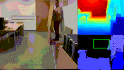

### Source codes for paper:

# Potential obstacles detection using RGB to depth image  encoder - decoder network: application to Unmanned Aerial Vehicles

Author: [Tomasz Hachaj](https://sppr.up.krakow.pl/hachaj/)

Abstract: This is an implementation of a method that allows the use of a single RGB camera for real-time detection of objects that could be potential collision sources for Unmanned Aerial Vehicles. 
The algorithm uses encoder-decoder deep neural network which estimate distance from a single image by performing RGB to depth mapping.
With only 6.3 million network parameters (weights) algorithm operates in real time.
The entire solution has been implemented and tested in practice in indoor enviroment using a [Tello](https://www.ryzerobotics.com/tello) drone with a front-facing RGB camera. 
Pretrained network weights are available to download.

Keywords: Encoder-decoder network; Depth prediction; RGB to depth mapping; obstacles detection; Unmanned Aerial Vehicles; Deep neural network; Tello drone

## Requirements

Keras >= 2.8, Tensorflow >= 2.8

To run in real time requires CUDA compatible GPU. Setup for [Windows](https://www.youtube.com/watch?v=EmZZsy7Ym-4). 

Tested on: PC, Intel i7-9700 3GHz, 64 GB RAM, NVIDIA GeForce RTX 2060 GPU, Windows 10 OS; 
DJI Ryze Tello Drone.

## How to run

### Training 
This step is optional: you can download pretrained weights [102 MB](https://sppr.up.krakow.pl/uav/potentialobstacles/modelOK.h5).

Download [NYU Depth V2 (50K)](https://tinyurl.com/nyu-data-zip) dataset 
and setup path in [data.py](training/data.py) script. 
Run [train_v2.py](training/train_v2.py).

On tested hardware setup training for 40 epochs lasted ~53 hours.

### Drone camera calibration
This step is optional: there is already file [tello/calibration_parameters.p](tello/calibration_parameters.p).

Capture camera data, you might want to use keyboard API from
[tello/DroneControllerTelloDepthDetectWarningClass.py](tello/DroneControllerTelloDepthDetectWarningClass.py).
Put images in [calibration/png](calibration/png) folder. 
Run [calibration/calibration.py](calibration/calibration.py). You might want to read [OpenCV camera calibration tutorail](https://docs.opencv.org/4.x/dc/dbb/tutorial_py_calibration.html).

### Running algorithm on drone

Download weights from [here](https://sppr.up.krakow.pl/uav/potentialobstacles/modelOK.h5)
and put in [tello](tello) dir. 

Connect WiFi to drone.

Run [tello/DroneControllerTelloDepthDetectWarningClass.py](tello/DroneControllerTelloDepthDetectWarningClass.py) script. Enjoy! :-)

Keys setup is in function "getKeyboardInput" in [tello/TelloDroneUtils.py](tello/TelloDroneUtils.py) script.

### Generating video from recorded files

Setup paths and use [tello/video_reader_depth_2.py](tello/video_reader_depth_2.py) script.

## Example resutls on Tello drone

 
 
 

Left - RGB image from drone camera, 

Top right - distance estimation by neural network,

Bottom right - obstacles detection. 

If rectangle is green no obstacles on drone course are detected.
If rectangle is red there are some obstacles on drone course.

## Downloads

Doenload pre-trained weights on NYU Depth V2 dataset [102 MB](https://sppr.up.krakow.pl/uav/potentialobstacles/modelOK.h5)

Download validation results as video files [825 MB](https://sppr.up.krakow.pl/uav/potentialobstacles/out_vid.zip) 

## Cite as

@Article{s22176703, 
AUTHOR = {Hachaj, Tomasz}, 
TITLE = {Potential Obstacle Detection Using RGB to Depth Image Encoder&ndash;Decoder Network: Application to Unmanned Aerial Vehicles}, 
JOURNAL = {Sensors}, 
VOLUME = {22}, 
YEAR = {2022}, 
NUMBER = {17}, 
ARTICLE-NUMBER = {6703}, 
URL = {https://www.mdpi.com/1424-8220/22/17/6703}, 
ISSN = {1424-8220} 
DOI = {10.3390/s22176703} 
}

## Source code references

I have used parts of source codes from:

[DenseDepth](https://github.com/ialhashim/DenseDepth)

[DJITelloPy](https://github.com/damiafuentes/DJITelloPy)